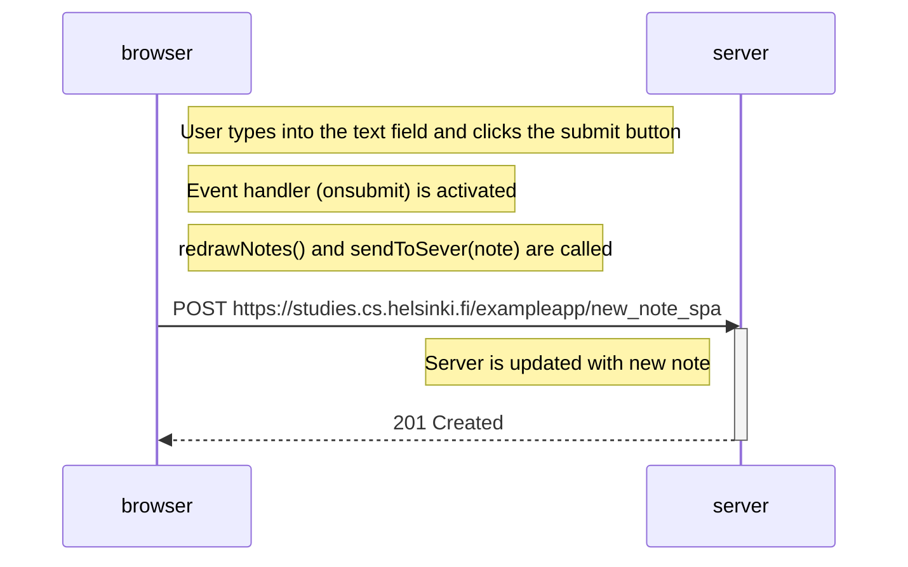

```mermaid
sequenceDiagram
    participant browser
    participant server

    Note right of browser: User types into the text field and clicks the submit button

    Note right of browser: Event handler (onsubmit) is activated
    Note right of browser: redrawNotes() and sendToSever(note) are called

    browser->>server: POST https://studies.cs.helsinki.fi/exampleapp/new_note_spa
    activate server
    Note left of server: Server is updated with new note
    server-->>browser: 201 Created
    deactivate server
```